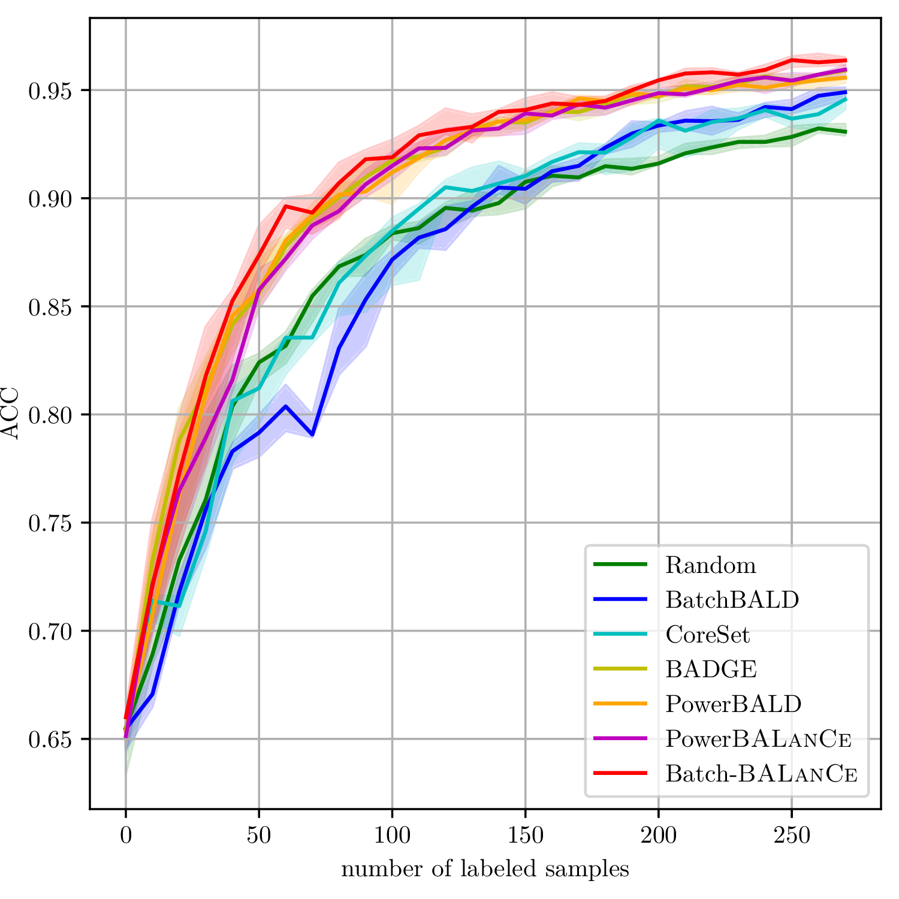

# [ICLR2023] Scalable Batch-Mode Deep Bayesian Active Learning via Equivalence Class Annealing
paper link: https://openreview.net/forum?id=GRZtigJljLY&referrer=%5BAuthor%20Console%5D(%2Fgroup%3Fid%3DICLR.cc%2F2023%2FConference%2FAuthors%23your-submissions)

<p align="center">

</p>
<p align="center">
<em> Learning curves on RepeatedMNIST dataset </em>
</p>

## Source codes for greedy selection 
in folder Greedy/

## Source codes for BALanCe-Clustering with MC-dropout
in folder BALanCe-Clustering/BALanCe-CIFAR10-MC-dropout/

## Source codes for BALanCe-Clustering with [cSG-MCMC](https://github.com/ruqizhang/csgmcmc)
in folder BALanCe-Clustering/BALanCe-CIFAR10-cSG-MCMC/

### AL trials on MNIST, EMNIST-Balanced, EMNIST-ByMerge, EMNIST-ByClass and Fashion-MNIST
go to the task folder, e.g., 
```
cd Misc/
```

go to data folder, e.g., 
```
cd data/MNIST/
```

download the data, e.g., 
https://github.com/pytorch/examples/tree/master/mnist

split the data
```
python make_lt.py
```

go to task main folder, run the commands, e.g.,
```
python main_eced.py
```

All the paramter are defined inside python file. The default ones are used in the paper.

### Fig. 1 and Fig. 2

go to folder Fig1-2/
```
cd Fig1-2
```

split the data as described by paper
```
python make_pt.py
```

train the BNN and draw 200 MC dropouts
```
python epsilon_net.py
```

run farthest-first traversal and draw the figs
```
python teo-heatmap.py
```

### Plot figures
The scripts for generate the learning curve is in Plot/ folder. You can specify log files and the legend.
